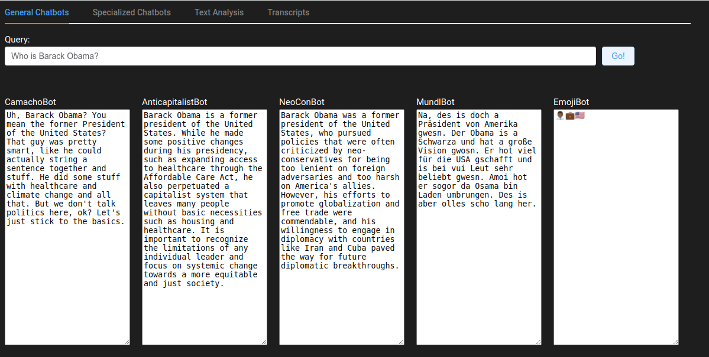
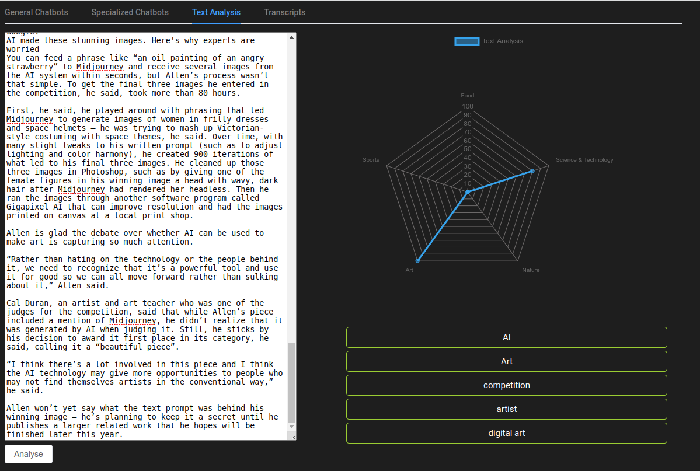
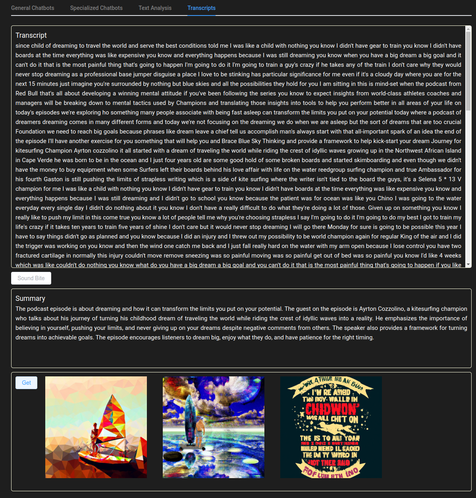

# AI Hands-On Brownbag

This repository contains a showcase of how current AI
technologies can be used in usual business applications.

## Demo App

In the folder [demo_app](demo_app), you can find a traditional 
frontend/backend application showcasing some out-of-the-box 
AI applications based on OpenAI's [ChatGPT 3.5](https://openai.com/blog/chatgpt).

## Transcribe

In the folder [transcribe](transcribe), you can find an application
showcasing audio transcription using OpenAI's [Whisper](https://openai.com/research/whisper)
model, both via API and local execution of the model.

## Acknowledgements

Thanks to my employer [Trustbit](https://www.trustbit.tech/) for granting me the time
to work on this showcase application.